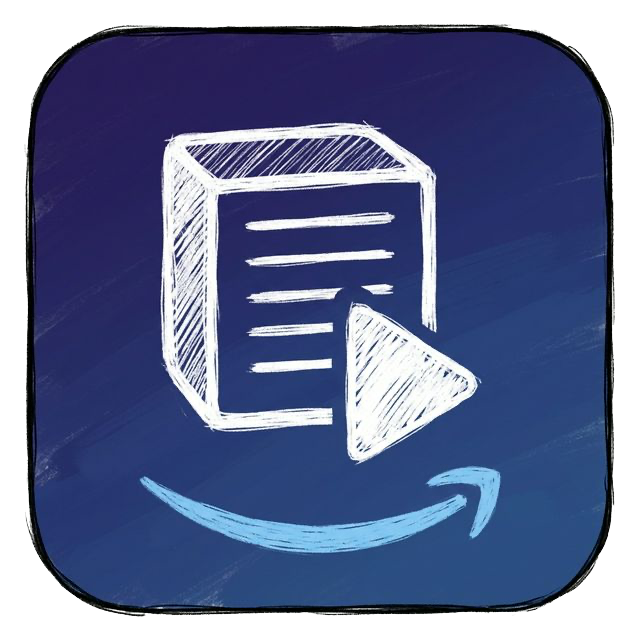

# Prime Video → Notion Importer

Prime Video の作品詳細ページから、タイトル・あらすじ・カバー画像などを抽出し、ワンクリックで Notion データベースへ登録する Chrome 拡張機能です。



## 主な機能

- **ポスター画像の自動抽出**: 高画質な公式ポスター画像を優先的に抽出。
- **イメージカルーセル**: 複数の候補から Notion のカバーにしたい画像を自由に選択可能。
- **複数画像の同時保存**: 選択した画像以外もプロパティに一括保存し、Notion 側でギャラリーとして活用可能。
- **リッチな編集機能**: タグ（ジャンル）、星評価（オススメ度）、コメントを登録前に編集可能。
- **重複チェック**: すでに登録済みの作品は警告を表示し、既存データを上書き更新。
- **最適化された抽出**: 不要なプレフィックス（「(字幕版)」など）を自動除去。

---

## セットアップ手順

使い始めるには **3 つの準備** が必要です。

### 手順 1 — Notion インテグレーションを作成する

Notion の API を使うために「インテグレーション（Integration）」と呼ばれる連携設定を作成し、**Notion Token** を取得します。

1. ブラウザで **[https://www.notion.so/profile/integrations](https://www.notion.so/profile/integrations)** を開く
2. 右上の **「+ 新しいインテグレーション」** をクリック
3. 以下のように入力して「保存」：
   - **名前**: 任意（例: `Prime Video Importer`）
   - **ワークスペース**: 使用する Notion のワークスペースを選択
   - **機能**: デフォルト（コンテンツの読み取り・更新・挿入）のままで OK
4. 作成後に表示される **「内部インテグレーションシークレット」（`ntn_` から始まる文字列）** をコピーして手元に控えておく

> ⚠️ このトークンは他人に見せないでください。

---

### 手順 2 — Notion データベースを用意する

拡張機能は以下のプロパティ名を持つ Notion データベースと連携します。
**全て同じ名前・型で作成してください。**

| プロパティ名 | 型 | 備考 |
|---|---|---|
| `Name` | タイトル | デフォルトで存在 |
| `URL` | URL | |
| `概要` | テキスト | あらすじ保存先 |
| `監督` | テキスト | 監督名の保存先 |
| `日付` | 日付 | 保存した日が自動入力 |
| `ステータス` | ステータス または セレクト | 鑑賞状況（例: 鑑賞終了、途中など） |
| `カバー画像` | ファイル＆メディア | ポスター画像の保存先 |
| `ジャンル` | マルチセレクト | タグの保存先 |
| `オススメ度` | セレクト | ★☆☆☆☆ 〜 ★★★★★ の5段階 |
| `鑑賞終了` | チェックボックス | 保存時に自動でオンになる |

#### データベースを作成したら、インテグレーションと接続する

1. Notion でデータベースを開き、右上の **「…」メニュー** をクリック
2. **「コネクト先を追加する」** を選択
3. 手順 1 で作ったインテグレーション名を検索して選択する

#### Database ID を取得する

Notion でデータベースを **フルページ** で開いたときの URL を確認します：

```
https://www.notion.so/xxxxxxxxxxxxxxxxxxxxxxxxxxxxxxxx?v=...
```

`notion.so/` の直後にある **32文字の英数字** が Database ID です。コピーして手元に控えておいてください。

---

### 手順 3 — 拡張機能に Token と Database ID を登録する

インストール直後に拡張機能のポップアップを開くと、**設定パネルが自動で表示されます**。

> ⚠️ **気をつけてほしいポイント**
>
> 設定パネルは初回以降、**ポップアップ下部の「⚙️ Settings」リンクをクリック** しないと表示されません。
> 設定済みかどうかに関わらず、保存に失敗する場合は必ず Settings を開いて内容を確認してください。

1. 拡張機能のアイコンをクリックしてポップアップを開く（Prime Video のページ以外でも開けます）
2. 下部の **「⚙️ Settings」** をクリック（初回は自動で開きます）
3. **Notion Token** 欄に手順 1 で取得した `ntn_...` の文字列を貼り付け
4. **Database ID** 欄に手順 2 で取得した 32 文字の ID を貼り付け
5. 入力は自動保存されます（保存ボタンは不要）

---

## インストール方法

1. このリポジトリを ZIP でダウンロードして任意のフォルダに展開する
2. Chrome で `chrome://extensions/` を開く
3. 右上の **「デベロッパー モード」** をオンにする
4. **「パッケージ化されていない拡張機能を読み込む」** をクリックし、展開したフォルダを選択する
5. 拡張機能がインストールされたら、上記「セットアップ手順」に従って設定する

---

## 使い方

1. Amazon Prime Video で任意の作品詳細ページを開く
2. ブラウザ右上の拡張機能アイコンをクリック
3. タイトル・画像・あらすじが自動入力されていることを確認
4. 必要に応じてタグ・ステータス・評価・コメントを編集
5. **「Notionに保存」** ボタンをクリック

---

## 開発履歴

詳細は [CHANGELOG.md](CHANGELOG.md) をご覧ください。
